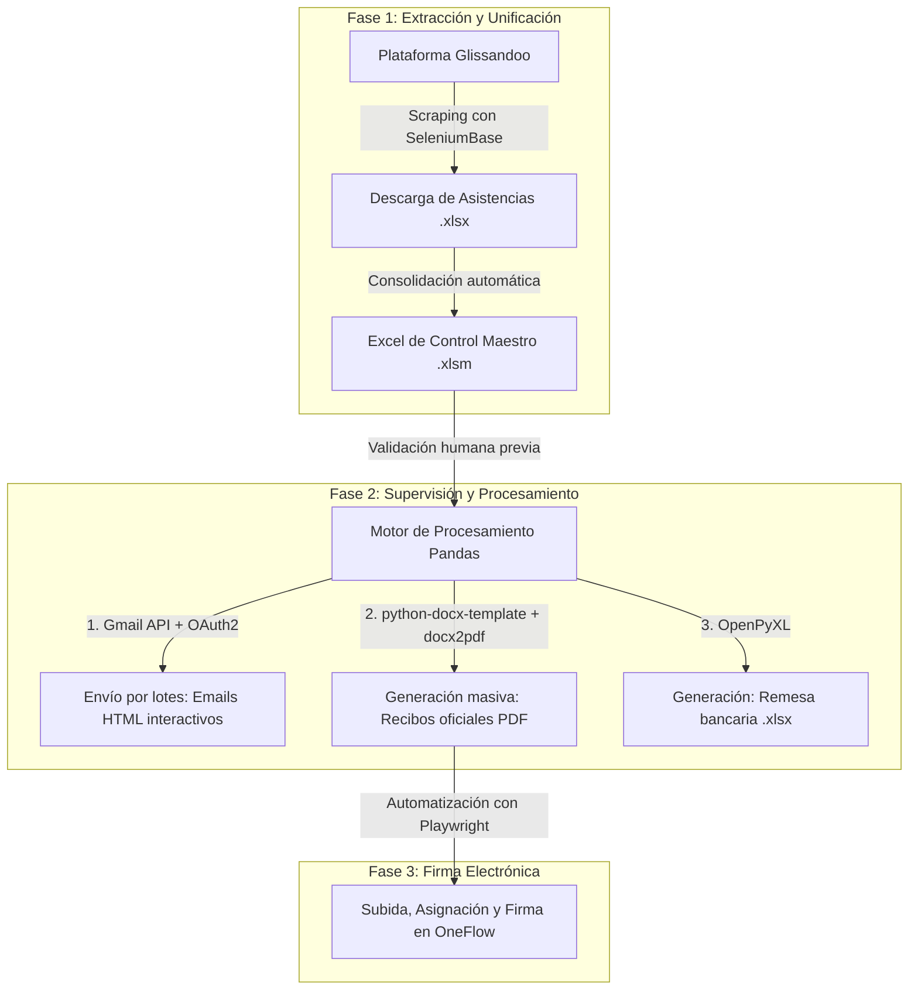

# 🎺 Sistema Automatizado de Gestión de Actos, Recibos y Remesas

[](https://www.python.org/)
[](https://playwright.dev/)
[](https://seleniumbase.io/)
[](https://pandas.pydata.org/)
[](https://developers.google.com/gmail/api)
[](https://opensource.org/licenses/MIT)

Solución integral de automatización desarrollada en **Python** para gestionar y optimizar el ciclo completo de liquidaciones económicas por acto, generación documental y remesas bancarias para la **Banda Sinfónica del Círculo Católico de Torrent (CCT)**.

---

## 💡 Contexto, Problema y Solución

### El Escenario Anterior (Herramientas Tradicionales)
Anteriormente, el flujo de trabajo dependía del ecosistema ofimático de Microsoft (**Excel, Word y Outlook**):
- A pesar de contar con ciertas automatizaciones nativas (como combinación de correspondencia o macros), requería una **alta intervención manual repetitiva** en cada fase del ciclo.
- Descargar acto por acto desde la plataforma de gestión web, volcar y casar los datos a mano en el Excel de control, generar uno a uno los documentos Word para pasarlos a PDF, gestionar envíos por correo y subir manualmente cada recibo a la plataforma de firma electrónica.
- El tiempo invertido por periodo de pago rondaba las **15-20 horas de trabajo administrativo (unas 4-5 tardes completas)**, con un alto riesgo de error humano por fatiga (cruces de datos, importes erróneos, envíos duplicados).

### La Solución Implementada
Un **pipeline unificado y modular en Python** que centraliza todo el ciclo en 3 comandos ejecutables, manteniendo la **supervisión y control humano** a través de la hoja de cálculo maestra:
- **Ahorro de tiempo superior al 95%:** De 20 horas de trabajo manual fragmentado a **menos de 5 minutos por fase de ejecución**.
- **Trazabilidad y validación:** Limpieza, normalización y validación estricta de datos con Pandas antes de cualquier emisión de correos o pagos.
- **Firma digital y remesas bancarias automatizadas:** Integración directa con OneFlow vía Playwright y generación automática del fichero SEPA/Excel para el banco.

---

## 🏗️ Arquitectura y Flujo de Datos



---

## 🚀 Módulos y Funcionalidades

### 1. Extracción de Asistencias (`src/descarga/`)
- Automatización web con **SeleniumBase** para autenticarse en Glissandoo, recorrer todos los actos del periodo dentro del rango de fechas configurado y descargar los reportes individuales.
- **Unificador inteligente (`unificar_actos.py`):** Cruza y consolida todos los asistentes en una única estructura tabular lista para volcar en el Excel de control.

### 2. Motor de Liquidación y Comunicación (`src/envio/`)
- **Procesamiento de Datos:** Parsing y normalización de actos regulares, actos generales y conceptos especiales mediante **Pandas**.
- **Notificaciones por Email:** Generación dinámica de plantillas HTML responsivas con el desglose exacto de actos y retribuciones de cada músico, enviadas mediante la **API de Gmail (OAuth2)** con control de velocidad (*rate limiting*) y modo de prueba (*safety check*).
- **Generación Documental:** Creación de recibos nominales en PDF a partir de una plantilla Word (`Recibo_Template.docx`).
- **Remesa Bancaria:** Generación de la orden de pago Excel con conceptos dinámicos según el periodo de cobro.

### 3. Automatización de Firma Digital (`src/envio/envio_recibos.py`)
- Script con **Playwright** que inicia sesión en **OneFlow**, crea documentos a partir de plantillas, sube cada PDF, asigna a la contraparte correspondiente y firma digitalmente el recibo de forma desasistida con control de logs (`enviados.txt`) y capturas de depuración en caso de incidencia.

---

## 📂 Estructura del Proyecto

```text
pago-actos/
├── src/
│   ├── assets/             # Plantillas de recibos (.docx) y recursos gráficos
│   ├── common/             # Configuración global, periodos y constantes (config.py)
│   ├── descarga/           # Scraping en Glissandoo y consolidación de asistencias
│   │   ├── descargar_actos.py
│   │   ├── pipeline_descarga.py
│   │   └── unificar_actos.py
│   └── envio/              # Pipelines de liquidación, correo, OneFlow y remesas
│       ├── envio_recibos.py
│       ├── excel_loader.py
│       ├── gmail_sender.py
│       ├── html_builder.py
│       ├── pipeline_envio.py
│       ├── receipts.py
│       ├── remesa.py
│       └── transform_data.py
├── scripts/                # Flujo de autenticación OAuth2 de Gmail
├── data/                   # Directorios locales de datos e informes (en .gitignore)
├── .env.example            # Plantilla de variables de entorno requeridas
├── requirements.txt        # Dependencias de Python
└── README.md
```

---

## 🛠️ Instalación y Puesta en Marcha

### 1. Clonar el repositorio
```bash
git clone https://github.com/raulml2/pago-actos.git
cd pago-actos
```

### 2. Instalar dependencias
```bash
pip install -r requirements.txt
playwright install chromium
```

### 3. Configurar variables de entorno
Copia `.env.example` a un archivo `.env` y añade tus credenciales:
```env
GLISSANDOO_URL=https://auth.glissandoo.com/es/signin
GLISSANDOO_EMAIL=tu_usuario
GLISSANDOO_PASSWORD=tu_password
GLISSANDOO_AGRUPACION=tu_agrupacion

ONEFLOW_URL=https://app.oneflow.com/login
ONEFLOW_EMAIL=tu_usuario
ONEFLOW_PASSWORD=tu_password

GMAIL_FROM=tu-email@gmail.com
GMAIL_PRUEBA=tu-email-pruebas@gmail.com
MODO_TEST=False
```

---

## 📖 Guía de Ejecución

El proyecto está diseñado para ejecutarse en 3 etapas secuenciales:

```bash
# ── ETAPA 1: Descargar asistencias desde Glissandoo ──
python -m src.descarga.pipeline_descarga

# ── ETAPA 2: Procesar datos, enviar emails informativos, generar PDFs y remesa ──
python -m src.envio.pipeline_envio

# ── ETAPA 3: Subir recibos y tramitar firmas en OneFlow ──
python -m src.envio.envio_recibos
```

---

## 🔒 Privacidad y Seguridad

- **Código Limpio:** El repositorio ha sido auditado y no contiene datos personales, DNIs, números de cuenta ni información sensible de terceros.
- **Aislamiento de Secretos:** Todas las credenciales se gestionan de forma estricta mediante variables de entorno locales (`.env`) y tokens temporales OAuth2 no versionados.
- **Ficheros de Datos:** Todos los archivos maestros (`.xlsm`, `.xlsx`), recibos generados (`.pdf`) y ficheros de asistencias se encuentran protegidos bajo `.gitignore`.

---

## 👤 Autor

**Raúl Méndez**
- **GitHub:** [@raulml2](https://github.com/raulml2)
- **LinkedIn:** [Raúl Méndez López](https://www.linkedin.com/in/raul-mendez-lopez)

---

## 📄 Licencia

Este proyecto está bajo la Licencia [MIT](LICENSE).
